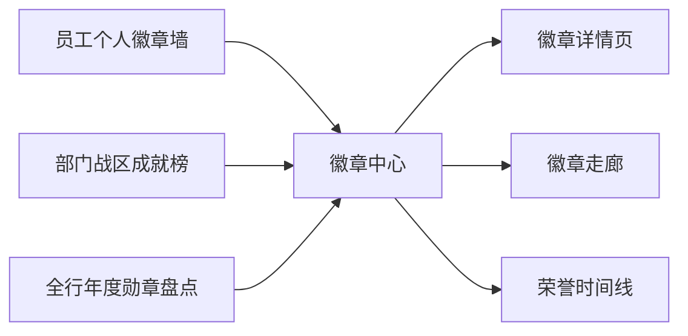
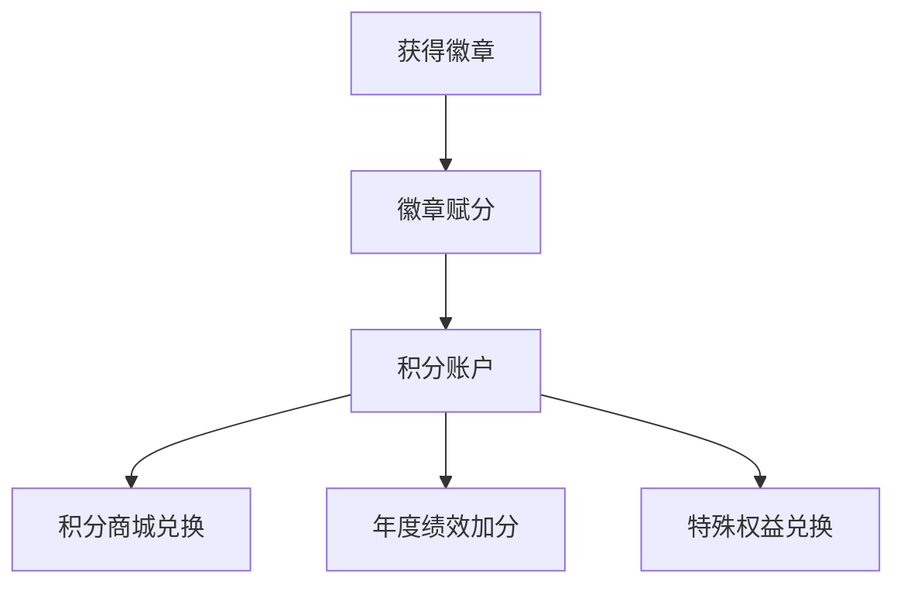
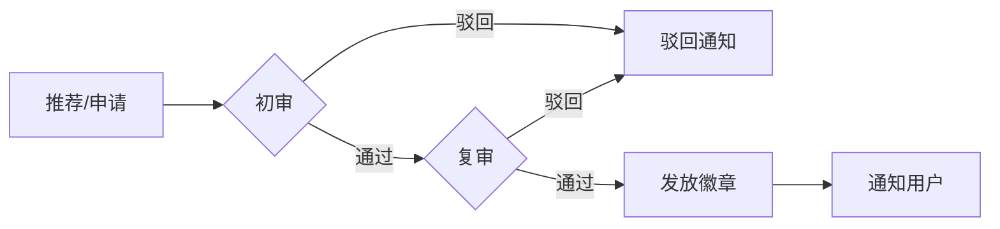
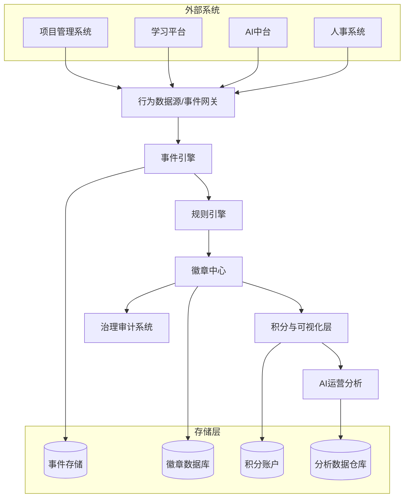
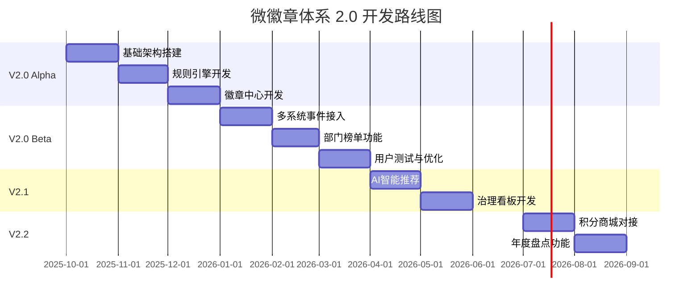

# 微徽章体系 2.0 升级方案

**MicroBadge System 2.0 - Product Requirements Document**

---

| 文档属性 | 内容 |
|---------|------|
| **文档版本** | v2.0.0 |
| **创建日期** | 2026-01-10 |
| **文档状态** | Draft |
| **产品负责人** | TBD |
| **技术负责人** | TBD |

---

## 🧭 产品概述（Overview）

**产品名称**：微徽章体系 2.0（MicroBadge System 2.0）

**版本目标**：在保持原有激励体系基础上，实现跨系统行为采集、智能徽章授予、徽章资产治理和文化传播四大升级。

**适用范围**：适用于全行科技条线及重点业务条线的员工激励与文化建设场景。

**版本定位**：银行内部激励与成长数字化平台的中枢组件，与数据中台、项目管理系统、学习平台实现联动。

---

## 🎯 一、目标与价值（Goals & Values）

| 目标类别 | 说明 |
|---------|------|
| **激励驱动升级** | 从"被动授予"转向"主动参与"，鼓励员工通过多维行为（学习、项目、创新、协作）自主成长。 |
| **数据智能化** | 引入 AI 分析行为模式，实现智能推荐徽章与个性化成长路径。 |
| **平台生态化** | 支持外部系统事件接入（API / Message Bus），统一徽章规则引擎。 |
| **管理治理化** | 构建徽章审核、回收、分级展示、统计分析等治理闭环。 |
| **文化可视化** | 通过徽章墙、战区榜、年度盘点等形式强化文化共鸣。 |

---

## 🧩 二、核心功能模块（Core Modules）

### 2.1 用户与身份体系（User System）

#### 2.1.1 用户角色定义

| 角色 | 权限描述 |
|------|----------|
| **普通员工** | 查看/申请徽章、查看个人徽章墙、分享徽章 |
| **部门管理员** | 审核申请、推荐徽章、查看部门统计 |
| **HR 管理员** | 管理激励规则与绩效关联配置 |
| **系统管理员** | 定义规则、生成统计报表、系统配置管理 |

#### 2.1.2 身份映射

- 从人事系统同步核心字段：
  - 工号（Employee ID）
  - 部门（Department）
  - 职级（Level）
  - 岗位（Position）
- 支持增量同步与全量同步两种模式
- 变更事件自动触发身份更新

#### 2.1.3 权限模型

```yaml
permissions:
  employee:
    - view_own_badges
    - apply_badge
    - share_badge
  department_admin:
    - review_applications
    - recommend_badge
    - view_department_stats
  hr_admin:
    - manage_incentive_rules
    - configure_performance_link
  system_admin:
    - define_rules
    - generate_reports
    - system_configuration
```

---

### 2.2 行为采集与事件引擎（Event Engine）

#### 2.2.1 数据来源

| 来源系统 | 事件类型示例 |
|---------|-------------|
| **项目管理系统** | 项目交付里程碑达成、攻坚项目参与 |
| **学习系统** | 课程完成、考试通过、学习时长达标 |
| **协作系统** | 会议纪要贡献、文档创建与编辑 |
| **AI 平台** | 创新案例提交、代码质量评估 |

#### 2.2.2 事件模型

```yaml
event:
  id: EVT-12345
  name: 项目交付里程碑达成
  source: project-platform
  trigger_type: system
  timestamp: 2026-01-10T10:30:00+08:00
  user_id: EMP-00001
  attributes:
    project_id: PRJ-2026-001
    project_name: 核心系统升级
    deliverable_score: 95
    milestone_type: major
```

#### 2.2.3 功能描述

| 功能 | 说明 |
|------|------|
| **事件接收** | 接受事件流（Kafka / RabbitMQ / HTTP Webhook） |
| **规则调用** | 调用规则引擎计算符合条件的徽章 |
| **处理模式** | 支持实时处理与批量处理两种模式 |
| **事件存储** | 事件日志持久化，支持回溯分析 |

---

### 2.3 徽章规则引擎（Badge Rules Engine）

#### 2.3.1 规则表达式支持

- YAML 配置格式
- JSON 配置格式
- SQL 条件表达式

#### 2.3.2 规则逻辑示例

```yaml
rule:
  id: RULE-005
  name: 攻坚先锋
  description: 项目交付评分达到90分以上
  enabled: true
  priority: 100
  condition:
    and:
      - event.name == "项目交付里程碑达成"
      - event.attributes.deliverable_score >= 90
  action:
    grant_badge: "攻坚先锋徽章"
    notify_user: true
    notify_manager: true
  cooldown: 30d
```

#### 2.3.3 规则引擎特性

| 特性 | 说明 |
|------|------|
| **多规则合并** | 支持多条件组合（AND/OR/NOT） |
| **优先级控制** | 规则冲突时按优先级执行 |
| **定期评估** | 每日/每周批次自动评估 |
| **冷却期机制** | 可配置冷却期防止刷徽章 |
| **版本控制** | 规则变更历史记录 |

---

### 2.4 徽章中心与展示层（Badge Center）

#### 2.4.1 徽章结构定义

| 属性 | 说明 | 示例值 |
|------|------|--------|
| **ID** | 唯一标识符 | B001 |
| **名称** | 徽章名称 | 攻坚先锋 |
| **类型** | 徽章类型 | 成长类/创新类/学习类/协作类/文化类 |
| **级别** | 徽章等级 | 铜/银/金/钻 |
| **图标** | 徽章图标资源 | /assets/badges/b001.svg |
| **描述** | 徽章说明 | 在重大项目中表现卓越 |
| **获取条件** | 授予条件 | 项目交付评分≥90 |
| **有效期** | 徽章有效期 | 365天/永久 |
| **积分值** | 对应积分 | 500 |

#### 2.4.2 徽章类型矩阵

| 类型 | 描述 | 示例徽章 |
|------|------|----------|
| **成长类** | 职业发展与能力提升 | 晋升之星、技能认证达人 |
| **创新类** | 创新贡献与突破 | 创新先锋、专利发明家 |
| **学习类** | 学习与知识积累 | 学习达人、知识分享者 |
| **协作类** | 团队合作与贡献 | 协作之星、跨部门桥梁 |
| **文化类** | 企业文化践行 | 文化大使、价值观标兵 |

#### 2.4.3 展示视图



| 视图 | 描述 |
|------|------|
| **员工个人徽章墙** | 展示员工获得的所有徽章，支持分类筛选 |
| **部门战区成就榜** | 部门维度的徽章统计与排名 |
| **全行年度勋章盘点** | 年度徽章发放统计与优秀案例展示 |
| **徽章走廊** | 按时间线展示徽章获取历程 |

---

### 2.5 激励闭环（Incentive Loop）

#### 2.5.1 积分与兑换机制



| 机制 | 说明 |
|------|------|
| **徽章赋分** | 根据徽章级别赋予对应积分 |
| **积分商城接口** | 对接内部积分商城系统 |
| **绩效加分接口** | 可选配置，与年度绩效考核关联 |

#### 2.5.2 积分等级对照

| 徽章级别 | 基础积分 | 稀有度加成 |
|---------|---------|-----------|
| 铜 | 100 | 1.0x |
| 银 | 200 | 1.2x |
| 金 | 500 | 1.5x |
| 钻 | 1000 | 2.0x |

#### 2.5.3 社交传播

| 功能 | 描述 |
|------|------|
| **内部IM分享** | 一键分享至企业微信/钉钉 |
| **周榜月榜推送** | 定期推送徽章获取排行榜 |
| **徽章故事** | 用户可撰写获取徽章的心得故事 |
| **点赞评论** | 支持同事间的互动鼓励 |

---

### 2.6 数据分析与AI运营（AI Ops）

#### 2.6.1 指标看板

| 指标类别 | 指标项 |
|---------|--------|
| **发放指标** | 徽章发放趋势、新增徽章数、累计徽章数 |
| **覆盖指标** | 部门覆盖率、员工覆盖率、活跃指数 |
| **关联分析** | 徽章与学习时长关联、徽章与项目贡献度关联 |

#### 2.6.2 智能推荐

```yaml
recommendation:
  type: next_badge
  algorithm: collaborative_filtering
  inputs:
    - user_behavior_history
    - similar_user_achievements
    - current_progress
  output:
    - recommended_badge_id
    - expected_completion_time
    - suggested_actions
```

| 功能 | 说明 |
|------|------|
| **下一徽章推荐** | 基于行为画像推荐下一个可获得徽章 |
| **完成路径指引** | 展示获取推荐徽章的具体行动建议 |
| **异常行为识别** | 识别滥用、代操作等异常行为 |

#### 2.6.3 分析样例

```yaml
insight:
  id: INS-001
  name: 部门徽章分布热力图
  metric: badge_distribution
  dimension: department
  output: heatmap
  refresh: daily
  
insight:
  id: INS-002
  name: 徽章获取与绩效相关性
  metric: badge_performance_correlation
  dimension: 
    - badge_category
    - performance_score
  output: scatter_plot
  refresh: monthly
```

---

### 2.7 治理与安全（Governance & Compliance）

#### 2.7.1 审核流程



| 阶段 | 负责角色 | 操作 |
|------|---------|------|
| **推荐** | 部门管理员/系统自动 | 发起徽章授予推荐 |
| **审核** | 指定审核人 | 审核材料真实性 |
| **发放** | 系统 | 自动完成徽章发放 |

#### 2.7.2 撤销机制

| 场景 | 处理方式 |
|------|----------|
| **错误授予** | 支持撤回，积分同步扣除 |
| **违规行为** | 强制撤销，记录违规档案 |
| **过期失效** | 自动标记为失效状态 |

#### 2.7.3 审计日志

| 日志类型 | 记录内容 |
|---------|----------|
| **规则变更日志** | 规则创建、修改、删除操作 |
| **徽章发放日志** | 发放时间、发放人、接收人、审核链 |
| **权限变更日志** | 角色分配、权限调整 |
| **异常操作日志** | 批量操作、撤销操作、越权访问 |

#### 2.7.4 数据合规

> [!IMPORTANT]
> 系统需严格遵守《个人信息保护法》相关要求

| 合规项 | 措施 |
|--------|------|
| **隐私脱敏** | 展示层数据脱敏处理 |
| **访问控制** | 按角色严格控制数据访问范围 |
| **数据加密** | 敏感数据加密存储 |
| **审计追溯** | 完整的数据访问日志 |

---

## 🧮 三、系统架构（System Architecture）

### 3.1 整体架构图



### 3.2 技术组件

| 层级 | 组件 | 技术选型建议 |
|------|------|-------------|
| **网关层** | 事件网关 | API Gateway + Kafka |
| **服务层** | 规则引擎 | Drools / Easy Rules |
| **服务层** | 徽章服务 | Spring Boot / Spring Cloud |
| **存储层** | 关系数据库 | MySQL / PostgreSQL |
| **存储层** | 缓存 | Redis |
| **分析层** | 数据仓库 | ClickHouse / Doris |
| **展示层** | 前端框架 | React / Vue.js |

### 3.3 接口设计

#### 3.3.1 事件接入接口

```yaml
# POST /api/v2/events
request:
  event_id: string
  event_name: string
  source: string
  user_id: string
  timestamp: datetime
  attributes: object

response:
  status: success | failed
  message: string
  processing_id: string
```

#### 3.3.2 徽章查询接口

```yaml
# GET /api/v2/users/{user_id}/badges
response:
  badges:
    - badge_id: string
      badge_name: string
      category: string
      level: string
      granted_at: datetime
      expires_at: datetime
      points: number
  total_count: number
  total_points: number
```

---

## ⚙️ 四、非功能需求（NFR）

| 分类 | 指标 | 要求 |
|------|------|------|
| **性能** | 事件处理能力 | 每秒处理 ≥ 100 条事件流 |
| **性能** | 页面响应时间 | ≤ 2 秒 |
| **可用性** | 系统可用性 | ≥ 99.9% |
| **可用性** | 故障恢复时间 | ≤ 30 分钟 |
| **安全** | 访问控制 | 数据访问权限分级控制 |
| **安全** | 数据传输 | HTTPS + 数据加密 |
| **兼容性** | 接口标准 | RESTful API + MQ 接入 |
| **兼容性** | 浏览器支持 | Chrome 80+, Edge 80+, Safari 13+ |
| **扩展性** | 徽章类型 | 支持新增徽章类型和自定义事件字段 |
| **扩展性** | 系统接入 | 支持新系统快速接入 |

---

## 🪄 五、示例徽章规则模板（YAML示例）

```yaml
badges:
  - id: B001
    name: 攻坚先锋
    description: 在重大攻坚项目中表现卓越，交付评分达到90分以上
    category: 项目贡献
    level: 金
    icon: /assets/badges/pioneer.svg
    condition:
      event: 项目交付里程碑达成
      metric: deliverable_score >= 90
    points: 500
    expires_in: 365d
    cooldown: 90d
    
  - id: B002
    name: 学习达人
    description: 年度累计学习时长达到40小时以上
    category: 学习成长
    level: 银
    icon: /assets/badges/learner.svg
    condition:
      event: 课程完成
      metric: course_hours >= 40
    points: 200
    expires_in: null  # 永久有效
    cooldown: 365d
    
  - id: B003
    name: 协作之星
    description: 积极参与团队协作，文档贡献达到10份以上
    category: 团队协作
    level: 铜
    icon: /assets/badges/collaborator.svg
    condition:
      event: 文档贡献
      metric: contribution_count >= 10
    points: 100
    expires_in: null
    cooldown: 30d
    
  - id: B004
    name: 创新先锋
    description: 提交创新案例并获得评审通过
    category: 创新贡献
    level: 金
    icon: /assets/badges/innovator.svg
    condition:
      event: 创新案例通过
      metric: approval_status == "approved"
    points: 800
    expires_in: null
    cooldown: 0d
    
  - id: B005
    name: 代码卫士
    description: 代码质量评估连续3个月达到A级
    category: 技术贡献
    level: 钻
    icon: /assets/badges/code_guardian.svg
    condition:
      and:
        - event: 代码质量评估
        - metric: quality_grade == "A"
        - metric: consecutive_months >= 3
    points: 1500
    expires_in: 365d
    cooldown: 180d
```

---

## 🔁 六、路线图（Roadmap）



| 阶段 | 时间 | 目标 | 关键交付物 |
|------|------|------|-----------|
| **V2.0 Alpha** | 2025Q4 | 基础功能上线 | 规则引擎 + 展示层 |
| **V2.0 Beta** | 2026Q1 | 生态接入 | 多系统事件流 + 部门榜单 |
| **V2.1** | 2026Q2 | 智能化升级 | AI智能推荐与治理看板 |
| **V2.2** | 2026Q3 | 激励闭环 | 积分商城与年度盘点功能 |

---

## 🧠 七、成功指标（KPIs）

| 指标 | 定义 | 目标值 | 数据来源 |
|------|------|--------|---------|
| **活跃员工覆盖率** | 拥有至少1个徽章的员工占比 | ≥ 80% | 徽章数据库 |
| **平均每人持徽章数** | 人均徽章数量 | ≥ 5 | 徽章数据库 |
| **项目贡献类徽章比例** | 项目贡献类徽章占总徽章的比例 | ≥ 40% | 徽章分类统计 |
| **系统事件响应延迟** | 从事件触发到徽章发放的平均时间 | ≤ 1s | 系统监控 |
| **年度文化满意度提升** | 员工文化满意度调研得分提升幅度 | ≥ 20% | HR调研 |
| **月活跃用户数** | 每月至少访问一次系统的用户数 | ≥ 60% | 访问日志 |
| **徽章分享率** | 获得徽章后进行分享的比例 | ≥ 30% | 分享日志 |

---

## 📋 八、附录

### 附录A：术语表

| 术语 | 定义 |
|------|------|
| **徽章（Badge）** | 对员工特定行为或成就的数字化认证符号 |
| **事件（Event）** | 来自外部系统的行为数据触发信号 |
| **规则引擎（Rules Engine）** | 根据预设条件判断是否授予徽章的逻辑处理器 |
| **冷却期（Cooldown）** | 同一徽章再次获取所需的最短间隔时间 |
| **徽章墙（Badge Wall）** | 展示用户获得所有徽章的个人页面 |

### 附录B：参考文档

- 企业人事系统接口文档
- 项目管理平台API规范
- 学习平台数据接口说明
- 积分商城对接方案

### 附录C：变更历史

| 版本 | 日期 | 变更内容 | 作者 |
|------|------|----------|------|
| v2.0.0 | 2026-01-10 | 初始版本创建 | - |

---

> [!NOTE]
> 本文档为微徽章体系 2.0 的产品需求文档初稿，后续将根据评审反馈持续更新完善。
